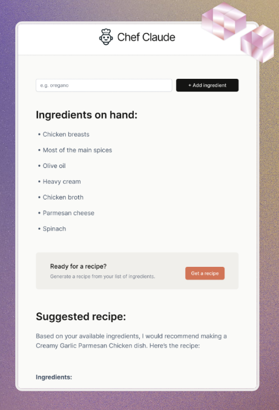

# Chef Claude

**Live demo:** [Kliknij tutaj, aby zobaczyc](https://marwoz01.github.io/chef-claude/)

Aplikacja pozwala wpisac liste skladnikow, a nastepnie pobiera realny przepis z darmowego publicznego API **TheMealDB**. Nie wymaga klucza API ani backendu.

---

## Podglad aplikacji



---

## Funkcje

- Dodawanie i usuwanie skladnikow
- Wyszukiwanie przepisow w TheMealDB
- Dobieranie najlepszego przepisu do podanych skladnikow
- Wyswietlanie zdjecia, skladnikow, instrukcji i linkow zrodlowych
- Prosty, responsywny interfejs

---

## Uruchomienie lokalne

```bash
cd chef-claude
npm install
npm run dev
```

---

## Technologie

- React + Vite
- CSS
- TheMealDB API
